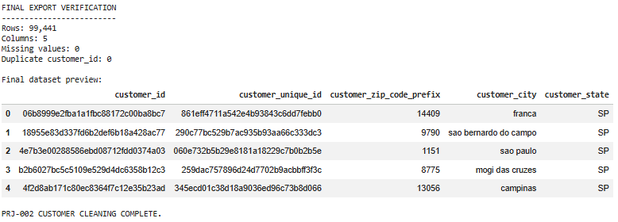

# Olist E-Commerce Customer Data Cleaning

A practical data-cleaning and validation project using **Python and Pandas** to transform raw customer data from the **Olist Brazilian E-Commerce Dataset** into a clean, consistent, and analysis-ready dataset.

---

## 📌 Project Overview

Data cleaning is one of the most important stages of a data analytics and data science workflow.

In this project, I worked with **99,441 customer records** from the Olist Brazilian E-Commerce Dataset.

The goal was to take the raw customer dataset, inspect its quality, standardize the data, validate its structure, and produce a reliable cleaned dataset that can be used for further analysis.

The project was completed using a structured **10-step Python data-cleaning workflow**.

The resulting dataset is prepared for future **SQL analysis and Power BI visualization**.

---

## 🎯 Project Objective

The main objective was to build a reproducible data-cleaning workflow that could:

- Inspect the raw dataset
- Standardize column names
- Clean text fields
- Validate customer identifiers
- Analyze repeat customers
- Check missing values
- Detect duplicate records
- Standardize ZIP code formatting
- Correct data types
- Run automated sanity checks
- Export and verify the final cleaned dataset

The emphasis was not simply on changing the data, but on **proving that the cleaned dataset was valid before using it for analysis**.

---

# 📊 Dataset

### Source

**Olist Brazilian E-Commerce Dataset**

### Dataset Used

Customer dataset containing information about customers and their geographic locations.

### Dataset Size

| Property | Value |
|---|---:|
| Records | 99,441 |
| Columns | 5 |
| Missing values found during initial inspection | 0 |

---

## Dataset Columns

| Column | Description |
|---|---|
| `customer_id` | Unique identifier for a customer record |
| `customer_unique_id` | Identifier representing the actual customer |
| `customer_zip_code_prefix` | Customer ZIP code prefix |
| `customer_city` | Customer city |
| `customer_state` | Customer state |

---

# ❓ Problem

Before a dataset can be used for analysis, its quality needs to be verified.

Even when a dataset appears clean at first glance, potential issues can include:

- Inconsistent text formatting
- Incorrect data types
- Duplicate records
- Non-unique identifiers
- Inconsistent ZIP code representation
- Missing values
- Structural inconsistencies

For this reason, the dataset was processed through a structured cleaning and validation workflow rather than being used directly for analysis.

---

# 🔧 Data Cleaning & Validation Workflow

The project followed a **10-step Python SOP**.

---

## Step 1 — Load the Dataset

The raw customer dataset was loaded into Python using **Pandas**.

The dataset was then prepared for systematic inspection and cleaning.

---

## Step 2 — Initial Dataset Inspection

The dataset was inspected to understand its basic structure.

The inspection included:

- Number of rows
- Number of columns
- Column names
- Data types
- Initial data preview
- Missing-value status

This established a baseline before making any transformations.

---

## Step 3 — Understand the Dataset Structure

The structure and purpose of each column were reviewed to determine how each field should be handled during cleaning.

Particular attention was given to:

- Customer identifiers
- Geographic information
- ZIP code formatting
- Text fields

---

## Step 4 — Standardize Column Names & Text

Column names were standardized using **snake_case** naming.

Text fields were cleaned to improve consistency.

The cleaning process included:

- Removing unnecessary whitespace
- Standardizing city text formatting
- Standardizing state abbreviations
- Preparing text fields for consistent downstream analysis

---

## Step 5 — Validate Customer Uniqueness

`customer_id` was checked to determine whether each customer record had a unique identifier.

The workflow also analyzed `customer_unique_id` to identify customers appearing in multiple records.

This distinction is important because:

- `customer_id` identifies a customer record
- `customer_unique_id` can identify the actual customer across records

The frequency of `customer_unique_id` values was therefore analyzed to identify repeat customers.

---

## Step 6 — Check Missing Values & Duplicate Rows

The dataset was checked for:

- Missing values by column
- Completely duplicated rows
- Duplicate customer identifiers

The purpose was to ensure that the cleaned dataset did not contain unexpected structural problems.

---

## Step 7 — Standardize ZIP Code Prefix

The `customer_zip_code_prefix` column was converted into a consistent **5-digit string format**.

Leading zeros were preserved.

For example:

```text
1151 → 01151
```

This is important because ZIP code prefixes are identifiers rather than numerical measurements.

They should therefore be treated as formatted strings rather than ordinary numbers.

---

## Step 8 — Correct Data Types

The dataset columns were explicitly converted to appropriate data types.

Identifier and geographic/text fields were stored as strings.

This included:

```text
customer_id
customer_unique_id
customer_zip_code_prefix
customer_city
customer_state
```

Explicit type conversion helps prevent unexpected behavior during future analysis.

---

# ✅ Step 9 — Automated Sanity Checks

After cleaning, automated assertions were used to verify that the dataset met the expected requirements.

The validation checks included:

### Row Count

The dataset was expected to contain:

```text
99,441 rows
```

### Column Count

The dataset was expected to contain:

```text
5 columns
```

### Column Structure

The expected column order was verified:

```text
customer_id
customer_unique_id
customer_zip_code_prefix
customer_city
customer_state
```

### Customer ID Uniqueness

`customer_id` was verified to contain no duplicate values.

### Missing Values

The dataset was verified to contain no missing values.

### Duplicate Rows

The dataset was checked for completely duplicated records.

### ZIP Code Format

ZIP code prefixes were verified to contain exactly **5 digits**.

### State Format

State codes were verified to contain exactly **2 uppercase letters**.

These automated checks provide a reproducible way of confirming that the dataset meets the expected quality requirements.

---

# 💾 Step 10 — Export & Final Verification

After all validation checks passed, the cleaned dataset was exported.

### Final Output

```text
olist_customers_cleaned.xlsx
```

The exported file was then reloaded into Python.

This final verification confirmed that:

- The file could be read successfully
- The expected number of rows remained
- The expected number of columns remained
- Missing values remained at zero
- `customer_id` remained unique
- The exported dataset retained the expected structure

This additional verification helps ensure that the final exported file itself—not just the DataFrame in memory—was valid.

---

# 📈 Before → After

| Data Quality Area | Raw Dataset | Cleaned Dataset |
|---|---|---|
| Records | 99,441 | 99,441 |
| Columns | 5 | 5 |
| Missing Values | 0 | 0 |
| `customer_id` | Validated | Unique |
| `customer_unique_id` | Analyzed | Validated |
| City Text | Standardized | Consistent |
| State Codes | Standardized | 2-letter uppercase |
| ZIP Prefix | Raw representation | 5-digit string |
| Data Types | Inspected | Explicitly defined |
| Duplicate Rows | Checked | Validated |

---

# 🔍 Project Evidence

The project includes visual evidence from the Python validation and final output stages.

---

## 1. Python Validation

The automated sanity checks were successfully executed after the cleaning process.


---

## 2. Final Export Verification

The exported dataset was reloaded and checked to confirm that the final output was valid.



---

## 3. Cleaned Dataset Preview

A preview of the final cleaned dataset is included below.


---

# 🧰 Tools & Technologies

| Tool | Purpose |
|---|---|
| **Python** | Data cleaning and validation |
| **Pandas** | Data manipulation and analysis |
| **Google Colab** | Python development environment |
| **Google Drive** | Dataset and notebook storage |
| **Google Sheets** | Initial inspection and final dataset review |
| **GitHub** | Version control and project portfolio |

---

# 🐍 Python Techniques Used

The project applied practical Python and Pandas techniques including:

- DataFrame inspection
- Column selection
- Missing-value detection
- Duplicate detection
- `groupby()`
- Frequency analysis
- String cleaning
- Data type conversion
- Nullable integer handling
- String formatting
- Zero-padding
- Boolean filtering
- Sorting
- Assertions
- CSV/Excel-style data export
- Reloading exported data for verification

---

# 📁 Repository Structure

```text
olist-ecommerce-customer-data-cleaning/
│
├── README.md
│
├── P02_Olist_Customers_Cleaning.ipynb
│
├── olist_customers_dataset.xlsx
│
├── olist_customers_cleaned.xlsx
│
└── images/
    │
    ├── python_validation.PNG
    ├── final_export_verification.PNG
    └── Cleaned_data_preview.PNG
```

---

# ▶️ How to Run the Project

## 1. Open the Python Notebook

Open:

```text
P02_Olist_Customers_Cleaning.ipynb
```

The notebook can be opened using **Google Colab** or another compatible Jupyter environment.

---

## 2. Use the Raw Dataset

The original dataset included in this repository is:

```text
olist_customers_dataset.xlsx
```

This represents the raw customer data used as the starting point of the project.

---

## 3. Run the Workflow

Execute the notebook cells in sequence.

The notebook performs the cleaning and validation workflow described in this README.

---

## 4. Review the Validation Results

The notebook performs automated sanity checks after cleaning.

The workflow is designed to stop with an assertion error if an expected data-quality requirement is not satisfied.

---

## 5. Review the Final Dataset

The final cleaned dataset is:

```text
olist_customers_cleaned.xlsx
```

This file represents the validated output of the project.

---

# 📚 What I Learned

This project provided practical experience with the complete lifecycle of a basic data-cleaning task.

Key learning outcomes included:

### Data Inspection

Understanding how to inspect a dataset before making transformations.

### Data Quality

Learning how to systematically check missing values, duplicates, identifiers, and formatting issues.

### Pandas

Building practical familiarity with Pandas DataFrames and common data-cleaning operations.

### Data Types

Understanding why identifiers such as ZIP codes should not always be treated as numerical values.

### Validation

Learning to use automated assertions rather than relying only on visual inspection.

### Reproducibility

Turning manual cleaning decisions into a repeatable Python workflow.

### Export Verification

Understanding that a successful DataFrame transformation is not enough; the exported file should also be reloaded and verified.

---

# 🔮 Downstream Analysis

This cleaned customer dataset is intended to become part of a larger Olist e-commerce analysis workflow.

The next stages can include combining this customer data with additional Olist datasets.

---

## SQL Analysis

Potential SQL analysis includes:

- Joining customers with orders
- Customer-level analysis
- Repeat-customer analysis
- Customer retention analysis
- Regional customer breakdown
- State-level analysis
- City-level analysis

---

## Power BI Analysis

The cleaned data can also support interactive dashboards containing:

- Customer geography
- State-level KPIs
- City-level analysis
- Geographic maps
- Customer distribution
- Regional comparisons

---

# 🎯 Project Purpose

This project is not intended to demonstrate a complex machine-learning model.

Instead, it demonstrates an important foundational data-science skill:

> **Taking raw data, cleaning it systematically, validating it programmatically, and producing a reliable dataset for downstream analysis.**

The workflow is designed to be **repeatable, verifiable, and understandable**.

---

# 📌 Project Status

**Status: Completed ✅**

The customer dataset has been:

- Inspected
- Cleaned
- Standardized
- Validated
- Exported
- Re-verified

The final dataset is ready for future **SQL and Power BI analysis**.

---

# 👤 Author

**Mahboob Ahmad**

Aspiring Data Scientist building practical projects in:

- Data Cleaning
- Python
- SQL
- Power BI
- Data Analysis
- Business Intelligence

---

## ⭐ Portfolio

This repository is part of my growing data-science portfolio, where I focus on building practical projects that demonstrate **real data workflows rather than only theoretical knowledge**.
